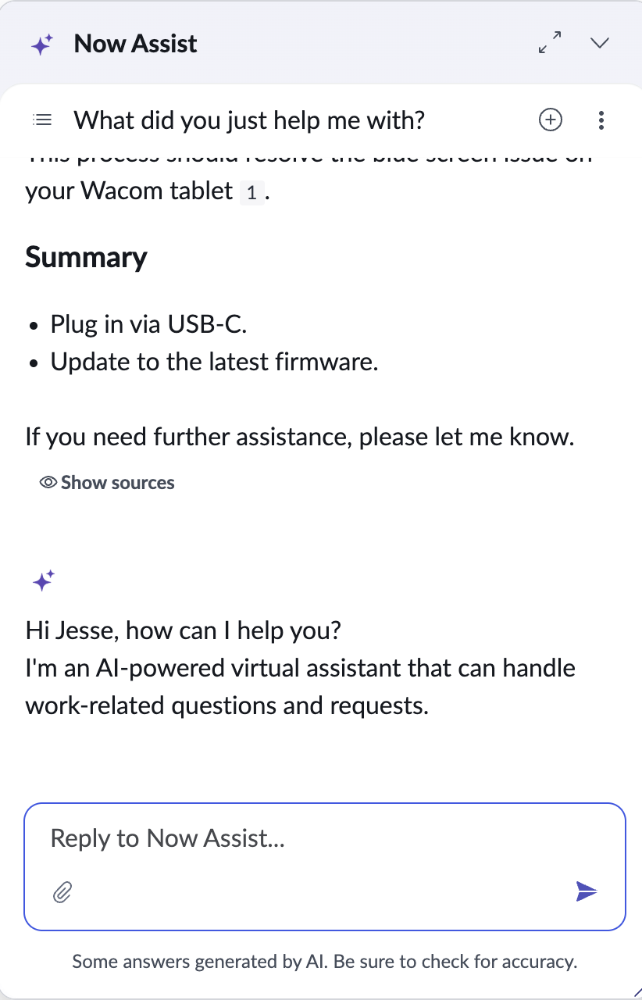

# New Chat Button Does Not Clear Conversation

**Date**: 2026-03-17

## Summary

Clicking the "New Chat" button in Virtual Agent does not clear the existing conversation. Instead, it appends the greeting message to the end of the current conversation, leaving all previous messages intact.

## Environment

- **OS**: MacOS
- **Browser**: Brave
- **Resolution**: 1440 x 900

## Steps to Reproduce

Intermittent

## Expected Behavior

The current conversation should be cleared and a fresh chat session should begin with only the greeting message displayed.

## Actual Behavior

The greeting message is appended to the bottom of the existing conversation. All previous messages remain visible, and the chat is not reset.

## Screenshots/Recordings

## Additional Context

First time encountering this issue.
