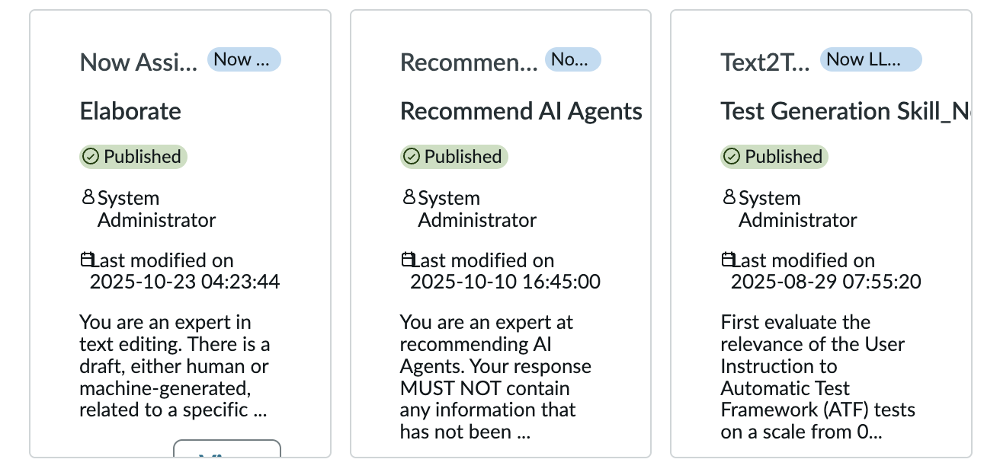

# Prompt Card Content Overflow

**Date**: 2026-03-17

## Summary

When creating a new custom skill, the content within individual prompt cards in the "Choose one from library" section is overflowing the card boundaries, making the cards difficult to read and interact with.

## Environment

- **OS**: MacOS
- **Browser**: Brave
- **Resolution**: 1440 x 900

## Steps to Reproduce

1. Go to Assistant Designer
2. Click edit on an existing assistant
3. Under asset types click custom skills
4. In the top right, click "Create" to create a new custom skill
5. Fill in the general info
6. In "Start prompt creation" click "Choose one from library"

## Expected Behavior

Card content stays contained within the card boundaries without overflowing.

## Actual Behavior

The content of individual prompt cards overflows beyond the card boundaries. This prevents the user from clicking the button to select the prompt card.

## Screenshots/Recordings

## Additional Context

N/A
