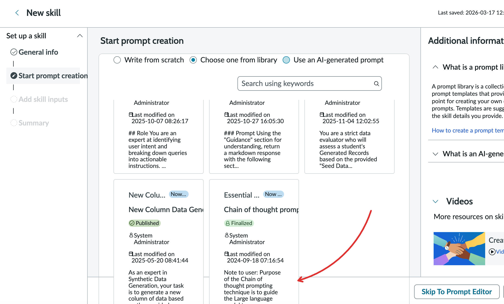

# Prompt Cards UI Overflowing

**Date**: 2026-03-17

## Summary

When creating a new custom skill, the prompt cards in the "Choose one from library" section are overflowing their containers, causing the UI to break and making it difficult for users to interact with the cards.

## Environment

- **OS**: MacOS
- **Browser**: Brave
- **Resolution**: 1440 x 900

## Steps to Reproduce

1. Go to Assitant Designer
2. Click edit on an existing assistant
3. Under asset types click custom skills
4. In the top right, click "create" to create a new custom skill
5. Fill in the general info
6. In "Start prompt creation" click "Choose one from library"

## Expected Behavior

a. Card content does not overflow their containers

## Actual Behavior

## Screenshots/Recordings

## Additional Context
