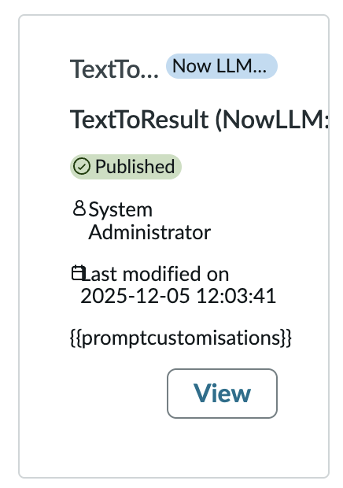

# Prompt Cards Variables Not Being Filled Out

**Date**: 2026-03-17

## Summary

When viewing prompt cards in the "Choose one from library" section, template variables such as `{{promptcustomisations}}` are displayed as raw text instead of being resolved to their actual values.

## Environment

- **OS**: MacOS
- **Browser**: Brave
- **Resolution**: 1440 x 900

## Steps to Reproduce

1. Go to Assistant Designer
2. Click edit on an existing assistant
3. Under asset types click custom skills
4. In the top right, click "Create" to create a new custom skill
5. Fill in the general info
6. In "Start prompt creation" click "Choose one from library"
7. Observe the description area on the prompt cards

## Expected Behavior

Template variables like `{{promptcustomisations}}` should be resolved and display their actual values within the prompt card description.

## Actual Behavior

The variable `{{promptcustomisations}}` is rendered as literal text on the prompt card, showing the raw placeholder instead of the resolved value.

## Screenshots/Recordings

## Additional Context

N/A
