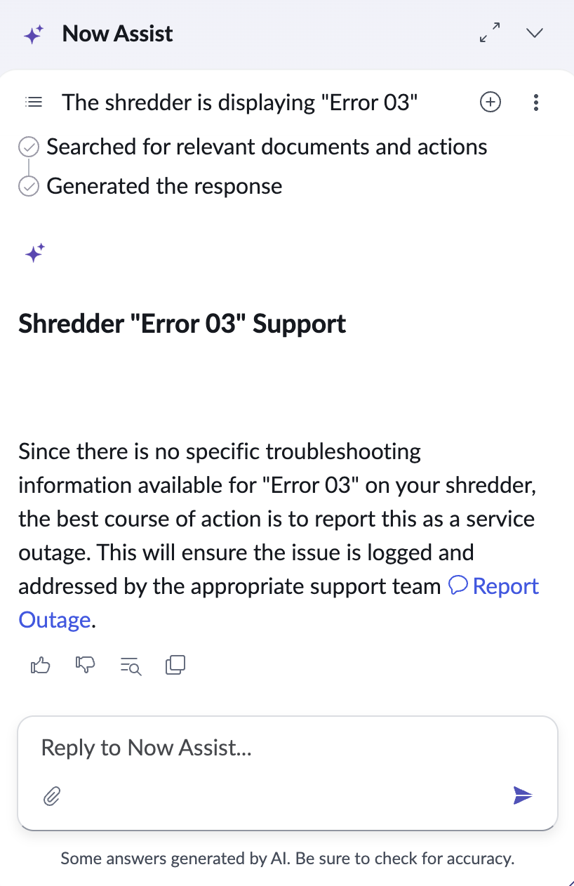

# Quoted Error Message Triggers Different Action

**Date**: 2026-03-17

## Summary

Putting an error message in quotes results in a different action being triggered compared to typing the same error message without quotes.

## Environment

- **OS**: MacOS
- **Browser**: Brave
- **Resolution**: 1440 x 900

## Steps to Reproduce

1. Set up a VA assistant with Incident in VA as fallback.
2. Type the following message: The shredder is displaying Error 03
3. Then start a new chat and type: The shredder is displaying "Error 03"

## Expected Behavior

Both prompts should trigger the same action, but the former goes to the fallback (correct), the latter recommends reporting an outage.

## Actual Behavior

{Describe what action gets triggered instead}

## Screenshots/Recordings

## Additional Context

N/A
